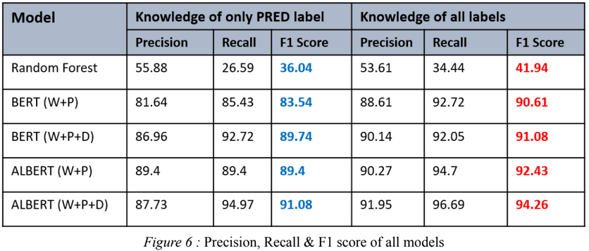

# Semantic Role Labelling on Nombank Dataset
 
* Built and analyzed deep learning models for partitive noun identification (ARG1) in the Nombank Dataset
* Utilized feature engineering to incorporate word and token level features
* Algorithms and Models reviewed include Random Forest, BERT and ALBERT.

---
### RESULTS
